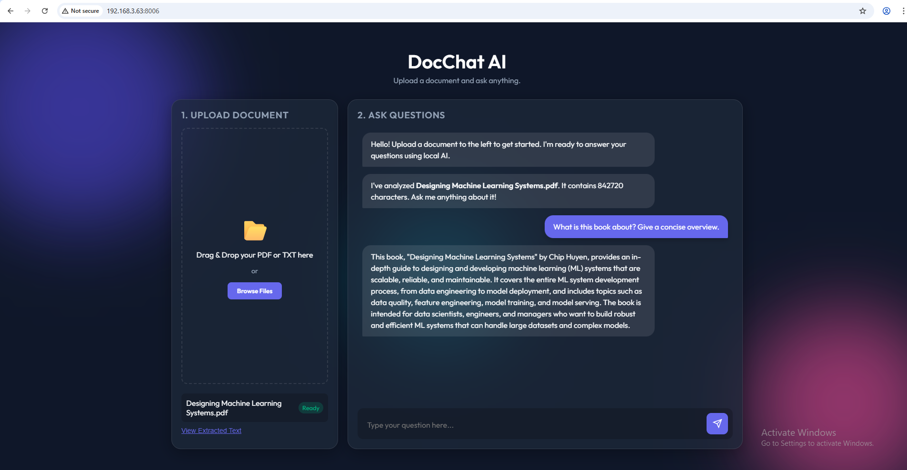

# 🚀 DocChat AI — Local Document Q&A using LLMs (Ollama + FastAPI)


DocChat AI is a **privacy-focused AI web application** that allows users to upload documents (PDF/TXT) and ask questions using a **local Large Language Model** powered by **Ollama**.

Unlike cloud-based AI tools, this project runs **fully offline**, ensuring secure document processing, zero API cost, and fast local inference.

---

## ✨ Demo Preview

### 🧾 Upload Interface


### 💬 Chat Interaction


---

## 🧠 Key Features

- Upload PDF or TXT documents  
- Automatic text extraction using `pypdf`  
- Context-aware document Q&A  
- Local LLMs via Ollama (LLaMA, Mistral, or any installed model)  
- Automatic model detection from Ollama  
- FastAPI async backend with REST APIs  
- Modern glass-style frontend UI  
- No OpenAI API keys required  
- Fully private & offline AI system  

---

## 🏗️ System Architecture

```
Frontend (HTML / CSS / JavaScript)
        │
        ▼
FastAPI Backend (main.py)
        │
        ├── extractor.py   → Document text extraction
        └── llm_client.py  → Local Ollama LLM interface
                                │
                                ▼
                        Local LLM (Ollama)
```

---

## 🧰 Tech Stack

- **Backend:** FastAPI, Python  
- **LLM Runtime:** Ollama (Local LLM Execution)  
- **Frontend:** HTML, CSS, JavaScript  
- **Document Processing:** PyPDF  
- **HTTP Client:** Requests  
- **Environment Management:** UV  

---

## 📂 Project Structure

```
DocChat-AI/
│
├── main.py
├── extractor.py
├── llm_client.py
├── pyproject.toml
├── uv.lock
├── .gitignore
├── README.md
│
├── static/
│   ├── index.html
│   ├── style.css
│   └── script.js
│
└── screenshots/
```

---

## ⚙️ Installation Guide

### 1️⃣ Clone the Repository

```bash
git clone https://github.com/YOUR_USERNAME/DocChat-AI.git
cd DocChat-AI
```

---

### 2️⃣ Create Virtual Environment (UV)

```bash
uv venv
```

Activate environment:

```bash
.venv\Scripts\activate
```

---

### 3️⃣ Install Dependencies

Using UV:

```bash
uv sync
```

Or manually:

```bash
pip install fastapi uvicorn requests pypdf python-multipart
```

---

### 4️⃣ Install Ollama (Local LLM)

Download Ollama from:

https://ollama.com

Pull a model locally:

```bash
ollama pull llama3
```

Verify Ollama:

```
http://localhost:11434
```

---

### 5️⃣ Run the Application

```bash
python main.py
```

Open browser:

```
http://localhost:8006
```

---

## 🔌 API Endpoints

### 📄 Extract Document

```
POST /api/extract
```

Uploads a document and extracts text.

---

### 🤖 Ask Question

```
POST /api/ask
```

Example Request:

```json
{
  "document_text": "string",
  "question": "string",
  "model": "llama3"
}
```

---

## 🔐 Privacy-First Local AI

This project avoids cloud APIs entirely.

- Fully offline processing  
- Zero data leakage  
- Faster local responses  
- Secure document handling  

---

## 💼 Technical Highlights (For Recruiters)

- Async FastAPI architecture  
- Modular LLM integration layer  
- Dynamic Ollama model selection  
- Context-restricted prompt engineering  
- Clean production-style project structure  
- Real-world AI application design  

---

## 🛠️ Future Improvements

- RAG with Vector Database  
- Streaming LLM responses  
- Multi-document memory  
- Authentication & user sessions  
- Docker deployment  

---

## 👨‍💻 Author

**Kunal**  
AI Developer | FastAPI | LLM Applications | Computer Vision

---

## 📄 License

This project is licensed under the [MIT License](LICENSE) — see the LICENSE file for details.

---

## ⭐ Support

If you found this project useful, consider giving the repository a ⭐!

